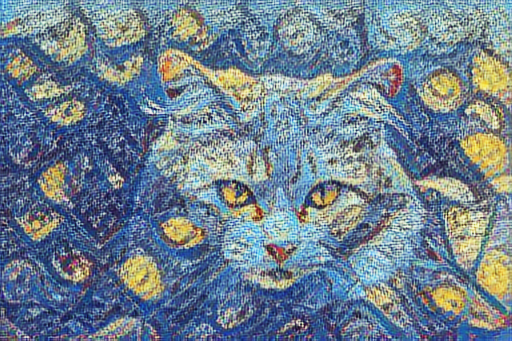

# CS 4210 Final Project

## Overview:
The goal of this project was to create a machine learning model that would perform an image style transfer given a content image and a style image as reference. The model should accurately identify the main content and overall style of the respective images, and combine them into a single output image.

## Updated Project Direction:

Rather than creating a custom model from scratch, this project now builds on the existing pre-trained TensorFlow Hub arbitrary image stylization model. The new project goal is to treat the pre-trained model as a baseline, then test ways to improve the final output so that the generated image preserves style features more clearly while keeping recognizable content.

## Intermediate Progress Report Project Status:

- Pipeline loads content and style images successfully
- TensorFlow Hub model produces a valid stylized output
- Main weakness:
  - Some styles from the reference style images are not properly represented in the output image
  - The main content of some of the more complex content images are not properly represented

## Updates:

The original notebook (just the pre-trained model from TensorFlow Hub) remains in the project directory:
- [style_transfer_original.ipynb]

The overall model flow / pipeline has been updated in the main notebook:
- [style_transfer.ipynb]

The updated notebook builds off of the TensorFlow Hub model, adding the following features:
- Multiple style passes to improve style transfer success
- Content preservation blending so output is closer to original image contents
- Style strength adjustments to test stronger or weaker stylization
- Comparison criteria for comparison and analysis of baseline model and the altered model

## Requirements:
Install the required modules if not already installed:
- tensorflow
- tensorflow_hub
- numpy
- matplotlib
- Pillow

## How to Run:
1. Put content image in /content_images, or skip this step to draw from existing demo images.
2. Put style image in /style_images, or skip this step to draw from existing demo images.
3. Run style_transfer.ipynb

## Main Files / Folder Structure:
- style_transfer.ipynb --> main implementation / code
- content/ --> demo content image inputs (5 default included)
- style/ --> demo style image inputs (5 default included)
- results/ --> generated result images
  - baseline/ --> baseline model output images
  - experiments/ --> altered model output images
  - comparisons/ --> comparison between baseline and altered model outputs

## Example Results:
Baseline Model Output:

Altered Model Output:
